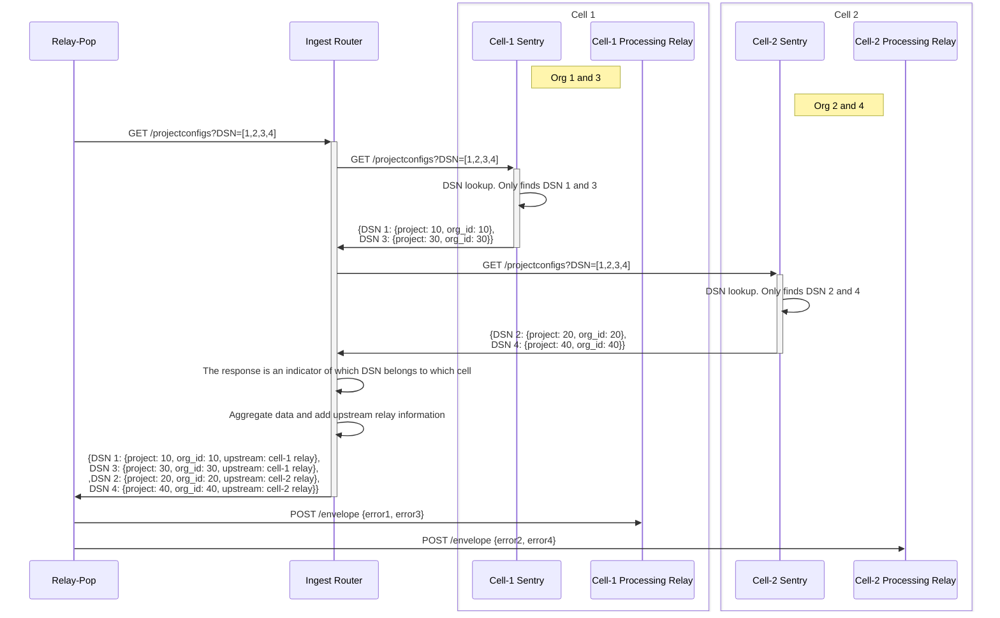

# Ingest Router

This is a simple ingest router that can be used to route requests to the appropriate downstream API destination for ingest APIs. *It does not handle ingest traffic. Only the API requests are routed.*

## Requirements

There are different types of requests that are routed. Each type of request has different requirements and constraints.

### Fetching project configs and global configs

  This is a POST request to the `/api/0/relays/projectconfigs/` endpoint. It has low latency and high throughput requirements. The request body might contain global config requests as well as project config requests.

  These requests need to be fan out to all the cells to fetch the project configs of public keys which may be in different cells. The response from each cell needs to be aggregated (the `configs` field) and the upstream cell information needs to be added to the response. The sequence diagram below shows the flow for this type of request.



### Endpoints needing clarification

```
POST /api/0/relays/register/challenge/
POST /api/0/relays/register/response/
POST /api/0/relays/publickeys/
GET /api/0/relays/ - This seems to be called from frontend. Need not be handled by the ingest router.
POST /api/0/relays/projectconfigs/ - This is fetching project ids from public keys. Might be similar to the project configs endpoint.
```
