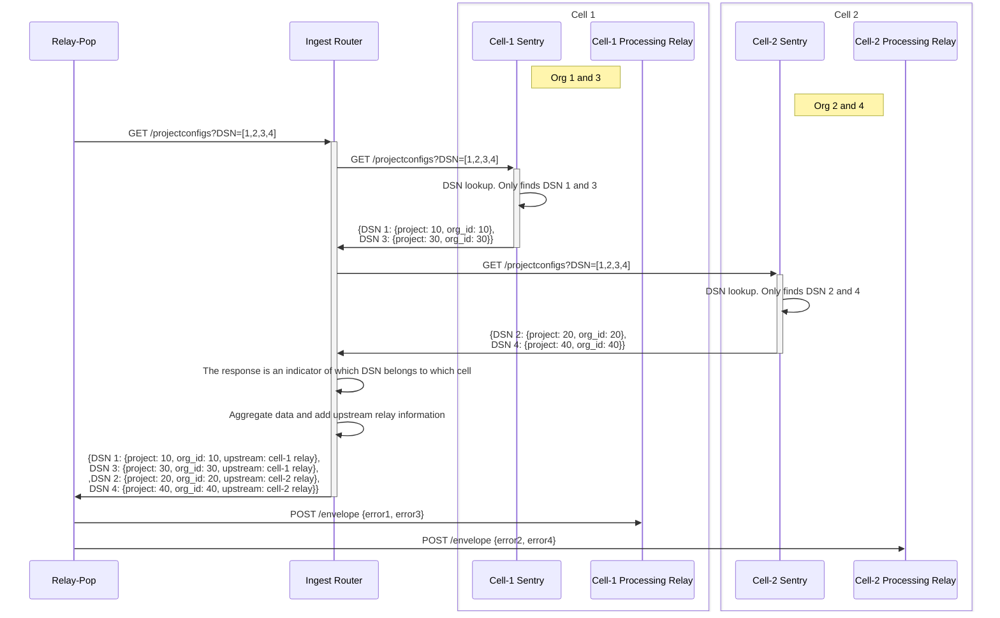
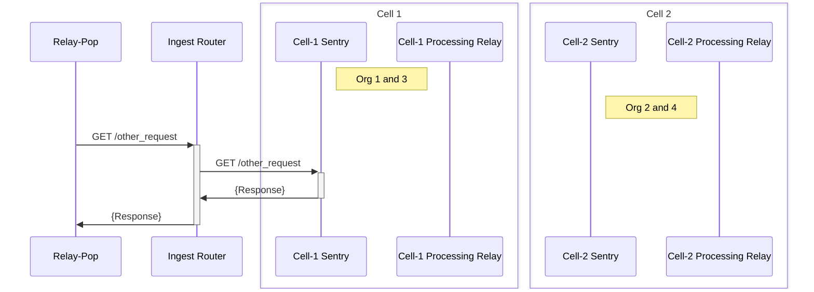

# Ingest Router

This is a simple ingest router that can be used to route requests to the appropriate downstream API destination for ingest APIs. *It does not handle ingest traffic. Only the API requests are routed.*

## Requirements

There are two types of requests that are routed:

### Project configs

  This is a POST request to the `/projectconfigs` endpoint. It has low latency and high throughput requirements.

  These requests need to be fan out to all the cells. The response from each cell needs to be aggregated
  and the upstream cell information needs to be added to the response. The sequence diagram below shows the flow for this type of request.



### Other requests

  These can be either GET or POST requests. They typically do not have high latency and high throughput requirements. For these requests, a configurable authoratative cell needs to be specified. The response from this cell needs to be returned to the client. The sequence diagram below shows the flow for this type of request.



## Design

The ingest router is primarily made up of 2 components:

1. A routing engine that matches requests to routes
2. A handler factory that creates handlers from route configurations

The routing engine is responsible for matching requests to routes. It uses a routing table to match requests to routes. The routing table is loaded from a YAML file. The YAML file is parsed and converted into a routing engine routes. An example of a routing engine route is shown below:

```yaml
- name: "single_cell_api"
  match:
    path_prefix: "/api/v1/"
    method: "POST"
  handler: "forward_to_cell"
  config:
    target: "http://us1.sentry.io/api/v1/"
- name: "multi_cell_api"
  match:
    path_prefix: "/api/v1/projectconfigs"
    method: "POST"
  handler: "fan_out_with_merge"
  config:
    targets:
      - "http://us1.sentry.io/api/v1/"
      - "http://us2.sentry.io/api/v1/"
```

The handler factory is responsible for creating handlers from route configurations. It uses the routing engine to match requests to routes and then creates the appropriate handler.
